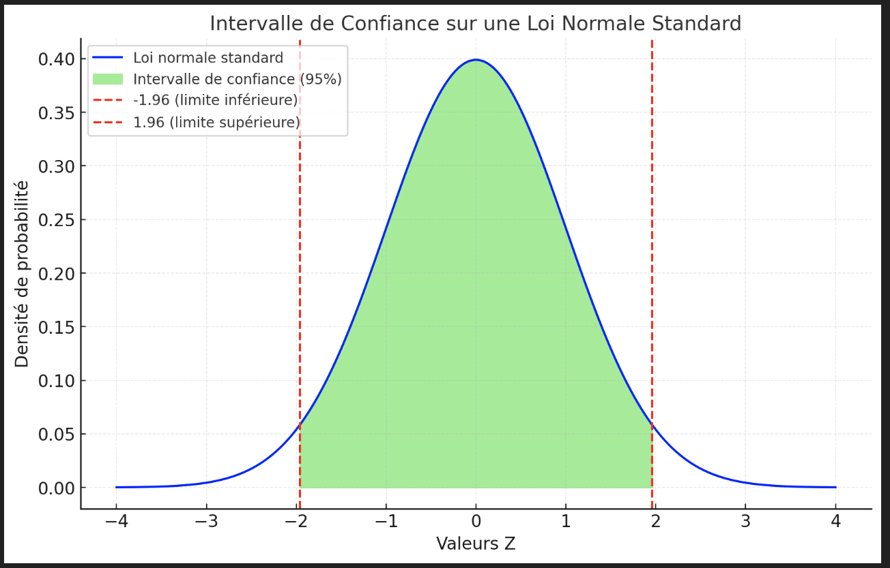

### Introduction à l'A/B Testing

## Intervalle de confiance

Pour utiliser un intervalle de confiance basé sur la loi normale, c'est ce que nous ferons ici dans les tests, voici les points essentiels à considérer :

1. **Hypothèse de normalité** : L'échantillon doit avoir une taille suffisante pour appliquer la loi normale (généralement $n \geq 30$). Le théorème central limite garantit que la moyenne des échantillons suit une distribution normale même si les données initiales ne sont pas normales.

2. **Conditions à vérifier** :
   - **Indépendance des observations** : Les données doivent être indépendantes.
   - **Échantillon aléatoire** : L'échantillon doit être représentatif de la population.
   - **Pour les proportions** : 
     - Vérifier que $n \times p \geq 10$ et $n \times (1 - p) \geq 10$.

3. **En pratique** : Si ces conditions sont remplies, on peut utiliser un intervalle de confiance basé sur la loi normale avec un score Z (par exemple, 1.96 pour un intervalle à 95%).

> [!IMPORTANT]  
> En résumé, pour des échantillons suffisamment grands et indépendants, la loi normale peut être utilisée pour calculer un intervalle de confiance.



Voici un schéma illustrant une loi normale standard et son intervalle de confiance à 95 %. L'intervalle de confiance est représenté en vert clair, entre les valeurs $Z = -1.96$ et $Z = 1.96$, correspondant à 95 % des données autour de la moyenne. Les lignes rouges pointillées marquent les limites de cet intervalle. 

Bien sûr ! Intégrons la formule des scores $Z$ dans l'exemple avec les notes d'examen pour le rendre encore plus clair. Voici une présentation complète :

---

### **Formule du score Z**  

Le score $Z$ permet de savoir combien d’écarts-types une valeur est au-dessus ou en-dessous de la moyenne. La formule est :

$Z = \frac{X - \mu}{\sigma}$

- $Z$ : le score standardisé (ou score Z).  
- $X$ : la valeur réelle que l'on analyse (par exemple, une note d'examen).  
- $\mu$ : la moyenne de la population.  
- $\sigma$ : l’écart-type de la population.

---

### **Exemple avec des notes d’examen**
Prenons les mêmes paramètres :
- $\mu = 75$ (moyenne des notes).  
- $\sigma = 10$ (écart-type des notes).  

#### **Calcul de quelques scores $Z$ et des valeurs réelles**  

| **$Z$** | **Valeur réelle ($X$)** | **Interprétation avec la formule**          |  
|-------------|-----------------------------|---------------------------------------------|  
| $-2$    | $X = 75 - 2 \times 10 = 55$ | $Z = \frac{55 - 75}{10} = -2$             |  
| $-1$    | $X = 75 - 1 \times 10 = 65$ | $Z = \frac{65 - 75}{10} = -1$             |  
| $0$     | $X = 75$                 | $Z = \frac{75 - 75}{10} = 0$              |  
| $+1$    | $X = 75 + 1 \times 10 = 85$ | $Z = \frac{85 - 75}{10} = +1$             |  
| $+2$    | $X = 75 + 2 \times 10 = 95$ | $Z = \frac{95 - 75}{10} = +2$             |  

#### **Explications pour chaque score Z**  
- **$Z = -2$** : Une note de **55** est **2 écarts-types en dessous de la moyenne**.  
- **$Z = 0$** : Une note de **75** est exactement à la **moyenne**.  
- **$Z = +2$** : Une note de **95** est **2 écarts-types au-dessus de la moyenne**.  

---

### **Graphique**  

- L’axe des abscisses est en écarts-types ($Z$), mais nous pouvons également annoter les valeurs réelles $X$ :
  - $Z = -2$ (55) ↔ $Z = -1$ (65) ↔ $Z = 0$ (75) ↔ $Z = +1$ (85) ↔ $Z = +2$ (95).

Ce schéma montre comment le score Z standardise les données tout en les reliant aux valeurs réelles.

---

### **Pourquoi utiliser le score Z ?**
- **Comparer facilement :** Peu importe si vous analysez des notes, des tailles ou des poids, le score Z vous indique combien une valeur est éloignée de la moyenne.  
- **Standardisation :** Vous pouvez utiliser ces scores pour différentes populations sans avoir à recalculer les échelles spécifiques.

## **Qu'est-ce qu'un A/B Test ?**

Un A/B test est une méthode utilisée pour comparer deux versions d'un même élément (par exemple, deux versions d'une page web, d'un bouton, ou d'un titre) et déterminer laquelle de ces versions est la plus efficace. 

L'objectif principal est de savoir quelle option, parmi deux, donne les meilleurs résultats. Par exemple, si vous êtes propriétaire d'un site web, vous pourriez tester deux versions d'une page d'accueil pour voir laquelle génère le plus de clics ou de conversions.

### Comment fonctionne un A/B Test ?

1. **Diviser les utilisateurs** : Vous partagez vos utilisateurs en deux groupes. Un groupe voit la version A (par exemple, un bouton rouge) et l'autre groupe voit la version B (un bouton bleu).
2. **Mesurer les résultats** : Vous mesurez les performances des deux versions sur un critère précis, comme le taux de clics ou le nombre d'achats.
3. **Comparer les performances** : Une fois que vous avez collecté suffisamment de données, vous comparez les résultats des deux versions pour voir laquelle est la meilleure.

---

### Exemple Simple : A/B Test sur un Taux de Conversion

Imaginons que vous voulez tester deux versions d'un bouton sur votre site. Vous voulez savoir si un bouton rouge (version A) fonctionne mieux qu'un bouton bleu (version B) pour inciter les gens à s'inscrire à une newsletter.

#### Données que vous avez collectées :
- Version A : 50% de personnes ont cliqué sur le bouton (parmi 1000 utilisateurs).
- Version B : 53% de personnes ont cliqué sur le bouton (parmi 1000 utilisateurs).

Votre objectif est de savoir si cette différence de 3% est significative ou si c'est simplement dû au hasard.

---

### Comment analyser les résultats ?

Pour analyser les résultats, nous allons effectuer deux étapes simples :

1. **Calculer la moyenne des clics pour chaque version**.
2. **Calculer l'intervalle de confiance** pour savoir si la différence observée entre les deux versions est suffisamment grande pour être considérée comme significative.

---

### Étape 1 : Calcul de la moyenne

La **moyenne** est simplement le taux de conversion pour chaque version. Par exemple, si 500 personnes sur 1000 ont cliqué sur le bouton dans la version A, le taux de conversion est 50% (500/1000).

En Python, on peut simplement écrire :

```python
# Nombre d'utilisateurs et de clics pour chaque version
clics_A = 500  # Nombre de clics pour la version A
clics_B = 530  # Nombre de clics pour la version B
total_A = 1000  # Total des utilisateurs pour la version A
total_B = 1000  # Total des utilisateurs pour la version B

# Calcul de la moyenne (taux de conversion)
moyenne_A = clics_A / total_A
moyenne_B = clics_B / total_B

print("Taux de conversion Version A:", moyenne_A)
print("Taux de conversion Version B:", moyenne_B)
```

#### Résultat attendu :
```
Taux de conversion Version A: 0.5
Taux de conversion Version B: 0.53
```

Cela signifie que la version B a un taux de conversion légèrement supérieur à la version A.

---

### Étape 2 : Calcul de l'intervalle de confiance

L'**intervalle de confiance** vous aide à comprendre l'incertitude liée à vos mesures. Par exemple, si vous avez un taux de conversion de 50%, l'intervalle de confiance pourrait être quelque part entre 48% et 52%, ce qui signifie que vous êtes relativement certain que le taux de conversion se trouve dans cette plage.

L'intervalle de confiance peut être calculé en utilisant la **formule suivante** :

$IC = \text{moyenne} \pm (z \times \frac{\text{écart type}}{\sqrt{n}})$

Où :
- $\text{moyenne}$ est le taux de conversion.
- $z$ est une constante qui dépend de l'intervalle de confiance souhaité. Pour 95%, $z$ est environ 1.96.
- $n$ est le nombre d'utilisateurs (1000 dans notre cas).

#### Calcul de l'écart type
L'écart type pour une proportion est calculé comme :

$\text{écart type} = \sqrt{\frac{p(1-p)}{n}}$

Où :
- $p$ est la proportion (le taux de conversion).
- $n$ est le nombre d'utilisateurs.

#### Code Python pour calculer l'intervalle de confiance :

```python
import math

# Fonction pour calculer l'écart type
def ecart_type(p, n):
    return math.sqrt((p * (1 - p)) / n)

# Fonction pour calculer l'intervalle de confiance
def intervalle_confiance(moyenne, ecart_type, n, z=1.96):
    erreur_standard = ecart_type / math.sqrt(n)
    marge_erreur = z * erreur_standard
    return (moyenne - marge_erreur, moyenne + marge_erreur)

# Calcul de l'écart type pour chaque version
ecart_type_A = ecart_type(moyenne_A, total_A)
ecart_type_B = ecart_type(moyenne_B, total_B)

# Calcul de l'intervalle de confiance
IC_A = intervalle_confiance(moyenne_A, ecart_type_A, total_A)
IC_B = intervalle_confiance(moyenne_B, ecart_type_B, total_B)

print(f"Intervalle de confiance pour la version A : {IC_A}")
print(f"Intervalle de confiance pour la version B : {IC_B}")
```

#### Résultat attendu :
```
Intervalle de confiance pour la version A : (0.480, 0.520)
Intervalle de confiance pour la version B : (0.510, 0.550)
```

Cela signifie que vous pouvez être assez sûr que le taux de conversion de la version A se situe entre 48% et 52%, et celui de la version B entre 51% et 55%.

---

### Conclusion

Si les intervalles de confiance des deux versions ne se chevauchent pas, vous pouvez conclure qu'il y a une différence significative entre les deux versions. Dans cet exemple, l'intervalle de confiance de la version B est supérieur à celui de la version A, ce qui suggère que la version B est probablement meilleure.

---

### Récapitulatif des étapes :

1. **Calculer la moyenne** de chaque groupe (A et B).
2. **Calculer l'écart type** pour chaque groupe.
3. **Calculer l'intervalle de confiance** à 95%.
4. **Comparer les résultats** pour savoir si la différence est significative.
