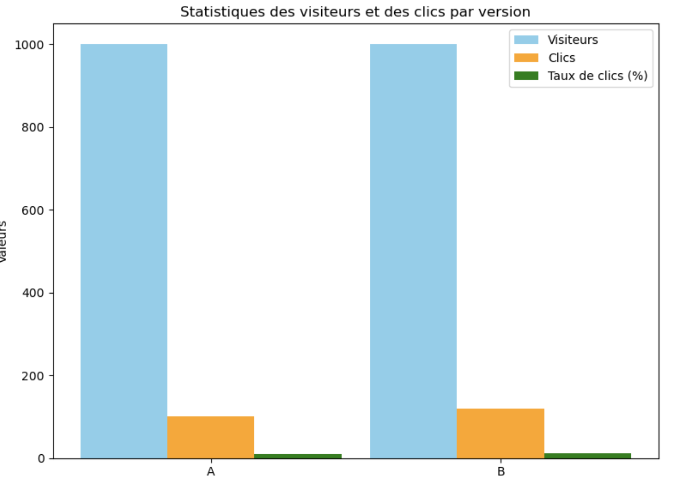

### Comprendre le test A/B   

Un test A/B consiste à comparer deux versions d'un élément (page web, bouton, texte, etc.) pour voir laquelle fonctionne le mieux auprès des utilisateurs.  
**Exemple concret** : Vous avez un site e-commerce, et vous voulez savoir si un bouton rouge (version A) ou un bouton vert (version B) pousse plus de gens à cliquer sur "Ajouter au panier".

---

### Étapes simples pour faire un test A/B 

#### Étape 1 : Choisir ce que vous voulez tester  
Exemples :  
- Le texte d'un bouton ("Acheter maintenant" vs "Ajouter au panier").  
- La couleur d'un bouton (rouge vs vert).  
- Une photo de produit (photo 1 vs photo 2).  

---

#### Étape 2 : Diviser vos visiteurs en 2 groupes  
Lorsque les utilisateurs arrivent sur votre site :  
- **50%** des visiteurs voient la **version A** (l'originale).  
- **50%** voient la **version B** (la nouvelle version).  

---

#### Étape 3 : Mesurer les résultats  
Pour chaque version, regardez combien de visiteurs :  
- **Cliquent sur le bouton.**  
- **Ajoutent un produit au panier.**  
- **Finalisent leur achat.**  

**Exemple simple :**  
- Version A : 1000 visiteurs, 100 clics sur le bouton → **10% de clics**.  
- Version B : 1000 visiteurs, 120 clics sur le bouton → **12% de clics**.  

---

#### Étape 4 : Comparer les résultats  
- Si la version B a un meilleur taux de clics que la version A, vous pouvez conclure que la version B est plus efficace.  
- Sinon, vous gardez la version A.

---

### (Exemple) Simuler un test A/B   
 
1. Divisez vos visiteurs en deux groupes (A et B).  
2. Notez combien de personnes ont cliqué pour chaque groupe.  
3. Calculez le taux de clics pour chaque groupe avec cette formule :  
   $\text{Taux de clics} = \frac{\text{Nombre de clics}}{\text{Nombre de visiteurs}} \times 100$  

**Exemple :**  
| Version | Nombre de visiteurs | Nombre de clics  | Taux de clics (%) |  
|---------|---------------------|------------------|-------------------|  
| A       | 1000                | 100              | 10%               |  
| B       | 1000                | 120              | 12%               |  

---

4. Faites un graphique (barres ou camembert) pour comparer les performances des deux versions, avec `matplotlib`.
 
- Si la version B a un meilleur taux de clics, elle devient la nouvelle version officielle.  
- Sinon, vous pouvez tester une autre idée ou garder la version actuelle.



---

### Exercice simuler le test suivant en Python

Imaginez que vous vendez des chaussures en ligne :  
- **Version A** : Un bouton bleu avec le texte "Acheter maintenant".  
- **Version B** : Un bouton rouge avec le texte "Ajouter au panier".  

1. Divisez vos visiteurs en 2 groupes égaux.  
2. Comptez combien de visiteurs cliquent sur chaque bouton.  
3. Comparez les résultats pour voir quel bouton fonctionne le mieux.  
4. Représentez graphiquement vos résultats.

---

### Approche avec des intervalles de confiances

Un test A/B implique de tirer des conclusions à partir d’un échantillon de données (les visiteurs de votre site). 

> [!NOTE]
> Les résultats que vous observez (ex. : taux de conversion) peuvent varier en fonction de la taille de l'échantillon et des fluctuations aléatoires.

L'**intervalle de confiance** vous donne une estimation de la fourchette dans laquelle la **valeur réelle** (exemple : le taux de conversion global) a une probabilité donnée (généralement 95 %) de se situer.

---

### Comment calculer un intervalle de confiance pour un test A/B ?

Pour chaque version (A et B), vous calculez :  
$IC = p \pm Z \cdot \sqrt{\frac{p(1-p)}{n}}$

- $p$ : Le taux de conversion observé ($\text{actions} / \text{visiteurs}$).  
- $n$ : Nombre total de visiteurs pour cette version.  
- $Z$ : Score Z correspondant au niveau de confiance (1.96 pour 95 %).  

#### Exemple :  
- Version A : $n_A = 1000$, $p_A = 0.12$ (12 % de conversion).  
- Version B : $n_B = 1000$, $p_B = 0.14$ (14 % de conversion).  

Pour la version A :  
$IC_A = 0.12 \pm 1.96 \cdot \sqrt{\frac{0.12 \cdot (1-0.12)}{1000}}$  
$IC_A = 0.12 \pm 0.0202 \quad \text{(soit [0.10, 0.14])}$

Pour la version B :  
$IC_B = 0.14 \pm 1.96 \cdot \sqrt{\frac{0.14 \cdot (1-0.14)}{1000}}$  
$IC_B = 0.14 \pm 0.0211 \quad \text{(soit [0.12, 0.16])}$

---

### Interprétation 
- **Si les intervalles de confiance des deux versions ne se chevauchent pas**, la différence est **statistiquement significative**.  
  - Dans cet exemple, les intervalles A [0.10, 0.14] et B [0.12, 0.16] se chevauchent légèrement → pas de conclusion ferme.  
- **Si les intervalles se chevauchent**, cela signifie qu’il est possible que la différence soit due au hasard.

---

### Relation avec le test statistique (Z-score et p-value) :
- L'intervalle de confiance et le test Z sont deux façons complémentaires d'évaluer les résultats :  
  - L'intervalle de confiance fournit une **fourchette d'estimation**.  
  - Le test Z fournit une **p-value** pour confirmer si la différence est significative. Nous allons aborder cette notion plus loin dans le cours.

---

###  Quand utiliser l'intervalle de confiance dans les tests A/B ?
- Lorsque vous voulez visualiser les résultats avec une **fourchette d’incertitude**.  
- Lorsque vous expliquez les résultats à un public non technique (c'est plus intuitif).  

---

### Pourquoi peut-on conclure si les intervalles ne se chevauchent pas ?

Lorsque deux intervalles de confiance ne se chevauchent pas, cela signifie que, selon les données disponibles :  

- Les différences observées entre les deux groupes (A et B) sont **suffisamment grandes** pour que l'incertitude autour de chaque moyenne ou proportion ne recouvre pas celle de l'autre.  
- En d'autres termes, **la variation due au hasard ne peut pas expliquer les résultats**.  

#### Exemple intuitif :  
Imaginez deux personnes mesurant leur taille :  
- Personne A mesure entre **1,50 m et 1,60 m** (intervalle).  
- Personne B mesure entre **1,70 m et 1,80 m** (intervalle).  

Les deux intervalles ne se chevauchent pas : vous êtes **sûr que la personne B est plus grande que la personne A**.

De la même manière, en statistiques, l'absence de chevauchement garantit que les deux groupes (A et B) ont des résultats réellement différents **au-delà des variations dues au hasard**.

---

### Pourquoi ne peut-on pas conclure si les intervalles se chevauchent ?
Quand les intervalles de confiance se chevauchent, il est possible que les différences observées entre les deux groupes soient simplement dues au **hasard statistique**.

#### Exemple intuitif :  
Reprenons l'exemple des tailles :  
- Personne A mesure entre **1,50 m et 1,60 m**.  
- Personne B mesure entre **1,55 m et 1,65 m**.  

Ici, il y a chevauchement : il est possible que la personne B soit plus grande, mais **on ne peut pas en être sûr**, car leurs tailles pourraient se situer dans la zone commune (**1,55 m à 1,60 m**). En statistique, cela revient à dire qu'il y a trop d'incertitude pour conclure.

Dans ce cas, il faut effectuer un test plus précis (comme calculer une **p-value**) pour déterminer si la différence est significative.

---

### Pourquoi cette différence ?
La différence entre les deux cas repose sur **l'incertitude associée à chaque échantillon**.  

- Les **intervalles de confiance** sont construits pour représenter cette incertitude.  
- Si deux intervalles se chevauchent, cela signifie que la "véritable valeur" (par exemple, le taux de conversion réel) pourrait se trouver dans la zone commune, donc il est **impossible de conclure avec certitude**.  
- Si les intervalles ne se chevauchent pas, alors la différence est **suffisamment grande pour écarter le hasard comme explication plausible**.

---

### En résumé :
- **Pas de chevauchement** : Vous pouvez conclure que les résultats sont **différents de manière significative**, car l’incertitude des deux groupes ne se recouvre pas.  
- **Chevauchement** : L'incertitude est trop grande, et il faut un test plus précis pour vérifier si la différence est statistiquement significative ou non.

## La p-value

La **p-value** (ou valeur p) est une **probabilité** utilisée en statistique pour mesurer la force des preuves contre l'**hypothèse nulle** ($H_0$) dans un test statistique.

---

### **1. Définition simple de la p-value :**  
La p-value répond à cette question :  
> Si l'hypothèse nulle est vraie, quelle est la probabilité d'observer une différence **au moins aussi extrême** que celle que nous avons mesurée ?  

En d'autres termes, elle mesure à quel point nos résultats sont inhabituels **sous l'hypothèse nulle**.  

- **Une petite p-value** (généralement $< 0.05$) indique que les résultats observés sont peu probables sous $H_0$, ce qui suggère qu’on peut **rejeter l'hypothèse nulle**.  
- **Une grande p-value** ($> 0.05$) indique que les résultats observés sont compatibles avec $H_0$, donc on **ne rejette pas l'hypothèse nulle**.

---

### **2. Hypothèse nulle et alternative :**  
- **Hypothèse nulle ($H_0$)** : Il n'y a **pas de différence** entre les groupes. Par exemple, dans un A/B test, $H_0$ signifie que les deux versions ont le même taux de conversion.  
- **Hypothèse alternative ($H_1$)** : Il y a **une différence** entre les groupes (positive ou négative).  

---


- **p-value petite ($< 0.05$)** :  
  - Les résultats observés sont improbables sous $H_0$.  
  - Cela suggère que l'hypothèse nulle est **fausse**.  
  - Vous pouvez conclure que la différence est **statistiquement significative**.  

- **p-value grande ($> 0.05$)** :  
  - Les résultats observés sont compatibles avec $H_0$.  
  - Cela signifie que vous **n’avez pas suffisamment de preuves pour rejeter $H_0$**.  

---

### **4. Exemple concret :**

Imaginons que vous faites un A/B test :  
- Version A : Taux de conversion $p_A = 12\%$, $n_A = 1000$.  
- Version B : Taux de conversion $p_B = 14\%$, $n_B = 1000$.  

Vous calculez une **p-value de 0.03** après un test statistique.

#### **Interprétation :**  
- Une p-value de **0.03** signifie qu’il y a seulement 3 % de chances d’observer une différence aussi importante entre $p_A$ et $p_B$ si $H_0$ (pas de différence) est vraie.  
- Comme 0.03 est inférieur au seuil classique de 0.05, vous **rejetez l'hypothèse nulle**.  
- Vous concluez que la version B a un meilleur taux de conversion que la version A, **de manière statistiquement significative**.

---

### **5. Ce que la p-value n’est pas :**  
- La p-value **ne donne pas la probabilité que l'hypothèse nulle soit vraie**.  
  - Exemple : Une p-value de 0.03 ne signifie pas que $H_0$ a 3 % de chances d'être vraie.  
- La p-value **ne mesure pas l'importance de l'effet**.  
  - Exemple : Une différence minuscule mais mesurée sur un très grand échantillon peut avoir une p-value très petite. Cela ne signifie pas que la différence est importante en pratique.

---

### **6. Résumé simple :**  
- **p-value petite ($< 0.05$)** → Résultat significatif → $H_0$ est rejetée.  
- **p-value grande ($> 0.05$)** → Résultat non significatif → $H_0$ n’est pas rejetée.  

Exactement, lorsqu'il y a un **chevauchement entre les intervalles de confiance**, il est difficile de conclure directement si la différence entre les deux groupes est significative. Dans ce cas, on utilise la **p-value** pour déterminer si cette différence est due au hasard ou si elle est statistiquement significative. Voici un exemple détaillé.

---

### Exemple avec chevauchement et utilisation de la p-value :

#### **1. Données :**  
- Version A :  
  - **Taux de conversion** ($p_A$) = **12 %**  
  - **Taille de l'échantillon** ($n_A$) = **1000**  

- Version B :  
  - **Taux de conversion** ($p_B$) = **14 %**  
  - **Taille de l'échantillon** ($n_B$) = **1000**  

#### **2. Calcul des intervalles de confiance (95 %) :**  
Pour chaque groupe, l'intervalle de confiance est donné par :  
$IC = \hat{p} \pm Z \times \sqrt{\frac{\hat{p}(1 - \hat{p})}{n}}$
Avec $Z = 1.96$ pour un intervalle de confiance à 95 %.

- **Version A :**  
$IC_A = 0.12 \pm 1.96 \times \sqrt{\frac{0.12 \times 0.88}{1000}}$ 
$IC_A = [0.104, 0.136]$

- **Version B :**  
$IC_B = 0.14 \pm 1.96 \times \sqrt{\frac{0.14 \times 0.86}{1000}}$  
$IC_B = [0.122, 0.158]$

#### **3. Observation :**
Les intervalles de confiance **se chevauchent** :  
- Version A : [0.104, 0.136]  
- Version B : [0.122, 0.158]  

**Conclusion provisoire :**  
Impossible de conclure directement, car il existe une zone commune entre les deux intervalles (de $0.122$ à $0.136$). On doit donc utiliser la **p-value** pour déterminer si la différence est significative.

## On utilise un autre test statistique la p-value

- Rappels des seuils 

- **p > 0,05** : Pas de différence significative (on ne rejette pas l’hypothèse nulle).  
- **p ≤ 0,05** : Différence significative (on rejette l’hypothèse nulle, avec un risque d’erreur de 5 %).  
- **p ≤ 0,01** : Différence très significative (on rejette l’hypothèse nulle, avec un risque d’erreur de 1 %).  
- **p ≤ 0,001** : Différence hautement significative (on rejette l’hypothèse nulle, avec un risque d’erreur de 0,1 %).  

Ces seuils sont des conventions, mais leur choix dépend du contexte et des conséquences d'une erreur.


```python
import math
from scipy.stats import norm

# Fonction pour calculer l'intervalle de confiance
def calculate_confidence_interval(n, p, z=1.96):
    margin_of_error = z * math.sqrt(p * (1 - p) / n)
    return (p - margin_of_error, p + margin_of_error)

# Données
p_A = 0.12  # Taux de conversion version A
n_A = 1000  # Taille de l'échantillon A
p_B = 0.14  # Taux de conversion version B
n_B = 1000  # Taille de l'échantillon B

# Calcul des intervalles de confiance
IC_A = calculate_confidence_interval(n_A, p_A)
IC_B = calculate_confidence_interval(n_B, p_B)

# Affichage des intervalles
print("Intervalle de confiance pour la Version A :")
print("Bas :", round(IC_A[0], 3), ", Haut :", round(IC_A[1], 3))

print("\nIntervalle de confiance pour la Version B :")
print("Bas :", round(IC_B[0], 3), ", Haut :", round(IC_B[1], 3))

# Utilisation de scipy pour la p-value
diff = abs(p_B - p_A)
erreur_combinee = math.sqrt((p_A * (1 - p_A)) / n_A + (p_B * (1 - p_B)) / n_B)
z_score = diff / erreur_combinee
p_value = 2 * (1 - norm.cdf(z_score))  # Test bilatéral

# Affichage de la p-value
print("\nP-value :", round(p_value, 4))

# Décision
if p_value < 0.05:
    print("Conclusion : La version B est meilleure avec une différence significative.")
else:
    print("Conclusion : Aucune différence significative, gardez la version A.")
```